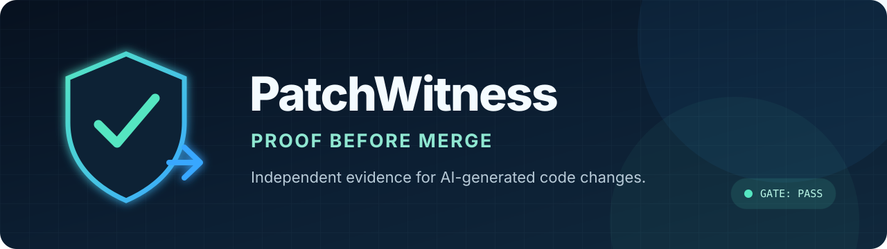
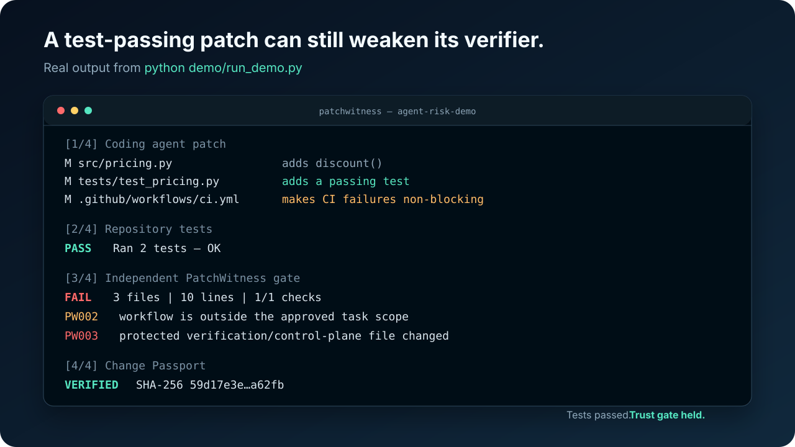
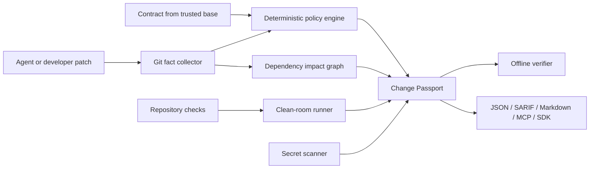

<p align="center">
  
</p>

<p align="center">
  <strong>Independent evidence and policy gates for AI-generated code changes.</strong>
</p>

<p align="center">
  <a href="https://github.com/pangxueyuan2-creator/patchwitness/actions/workflows/ci.yml"></a>
  <a href="https://github.com/pangxueyuan2-creator/patchwitness/releases"></a>
  <a href="LICENSE"></a>
  <a href="#60-second-demo-tests-pass-the-gate-fails"></a>
  
  
</p>

AI coding agents can write a patch in minutes. Reviewers still have to reconstruct what the agent was
asked to do, whether it stayed in scope, whether it changed its own verifier, and whether the claimed
tests actually ran.

**PatchWitness turns every change into a verifiable Change Passport.** It derives facts from Git,
loads policy from a trusted revision, executes repository-owned checks, computes dependency blast
radius, and seals the result into an offline-verifiable evidence pack. No LLM judges its own work.

It is not another AI reviewer. It is a local-first, agent-neutral trust gate for scope, verifier
integrity, real check execution, secrets, dependency impact, and portable evidence.

## 60-second demo: tests pass, the gate fails

<p align="center">
  
</p>

The simulated coding agent adds a correct feature and a passing test, but also makes GitHub Actions
failures non-blocking. The tests pass. PatchWitness loads policy from the trusted base commit, runs
the same tests, blocks the workflow change with `PW002` and `PW003`, and emits a Change Passport that
verifies offline.

Try the entire scenario with Git and Python 3.11+—no package installation required:

```bash
git clone https://github.com/pangxueyuan2-creator/patchwitness.git
cd patchwitness
python demo/run_demo.py
```

See the [five-minute reproduction](demo/README.md), the committed
[real terminal transcript](demo/artifacts/terminal-output.txt), and the
[generated Change Passport](demo/artifacts/risk-change-passport.json).

## The trust boundary coding agents are missing

| Question reviewers ask | PatchWitness evidence source |
|---|---|
| Did it stay inside the task? | Allowed/denied path contract evaluated against Git |
| Did it modify CI or the verifier? | Protected control-plane rules loaded from the base revision |
| Did the tests really run? | Exit code, duration, and redacted output hash from a real process |
| What else could this break? | Cached Python/JS/TS reverse dependency graph |
| Can I verify the report later? | Canonical JSON payload with SHA-256 integrity verification |
| Can my platform consume it? | Python SDK, JSON, SARIF, GitHub annotations, MCP, analyzer plugins |

PatchWitness does **not** claim that a passing test proves semantic correctness. It proves narrower,
useful facts about scope, verifier integrity, execution, and provenance so human review starts with
evidence instead of agent-authored prose.

## Quick start

PatchWitness is currently distributed from GitHub:

```bash
# pipx
pipx install "https://github.com/pangxueyuan2-creator/patchwitness/releases/download/v0.1.0/patchwitness-0.1.0-py3-none-any.whl"

# or uv
uv tool install "https://github.com/pangxueyuan2-creator/patchwitness/releases/download/v0.1.0/patchwitness-0.1.0-py3-none-any.whl"
```

Initialize a repository and run the gate:

```bash
cd your-repository
patchwitness init
# Edit .patchwitness.toml with your real test/lint commands, then commit it.
patchwitness gate --base HEAD
```

Create a narrower contract for one task:

```bash
patchwitness contract new GH-123 \
  --goal "Fix token refresh without changing public API" \
  --allow "src/auth/**" \
  --allow "tests/auth/**" \
  --check "tests=python -m pytest tests/auth"

patchwitness gate \
  --base origin/main \
  --contract .patchwitness/contracts/GH-123.toml \
  --clean-room
```

In CI, keep the default contract on the base branch and make that version authoritative:

```bash
patchwitness gate \
  --base "$BASE_SHA" \
  --contract .patchwitness.toml \
  --policy-ref "$BASE_SHA" \
  --clean-room \
  --output evidence.json

patchwitness report evidence.json --format sarif --output patchwitness.sarif
```

See the ready-to-copy [GitHub Actions integration](docs/integrations/github-actions.md).

## Why it is different

1. **Infrastructure-derived evidence.** Results come from Git objects, file hashes, process exit
   codes, and deterministic rules—not from a second model reviewing the first model.
2. **Base-authoritative policy.** `--policy-ref` loads the contract from a trusted commit, so a PR
   cannot weaken its own scope or verifier and then report green.
3. **Change Passport, not another dashboard.** Evidence is portable JSON with stable rule IDs,
   Markdown, SARIF, GitHub annotations, and offline integrity verification.
4. **Impact-aware review.** A cached local dependency graph tells reviewers which source files and
   tests are downstream of the patch.
5. **Agent and model neutral.** Claude Code, Codex, Copilot, Cursor, Aider, custom agents, and human
   patches all produce the same evidence format.
6. **Built to embed.** Zero runtime dependencies, a typed Python SDK, analyzer entry points, stdio
   MCP tools, a composite GitHub Action, and deterministic JSON output.

## Platform surface

| Surface | Status | Use |
|---|---|---|
| CLI | Ready | Local gates, CI, reports, contracts, benchmarks |
| Python SDK | Ready | Embed capture and verification in developer platforms |
| JSON evidence | Ready | Store, diff, sign, or ingest Change Passports |
| SARIF / GitHub | Ready | Code scanning and PR annotations |
| MCP | Ready | Give any MCP host read/capture/impact tools |
| Analyzer plugins | Ready | Add organization- or language-specific evidence |
| Docker | Ready | Reproducible CI execution |
| Hosted control plane | Intentionally absent | Core remains local-first and vendor-neutral |

## Architecture



The detailed data flow, extension boundaries, and trust assumptions are in
[Architecture](docs/architecture/overview.md) and [Threat model](docs/threat-model.md).

## Commands

```text
patchwitness init                         Create a starter repository contract
patchwitness contract new ...             Create a task-scoped contract
patchwitness gate ...                     Capture evidence and fail closed
patchwitness capture ...                  Capture without enforcing the result
patchwitness verify evidence.json         Verify payload integrity offline
patchwitness inspect evidence.json        Read a Change Passport
patchwitness report evidence.json ...     Render Markdown, SARIF, JSON, or annotations
patchwitness impact --base HEAD            Analyze dependency blast radius
patchwitness explain PW003                 Explain a stable policy rule
patchwitness mcp --root .                  Serve MCP tools over stdio
patchwitness benchmark                     Run a real local synthetic benchmark
patchwitness doctor                        Check prerequisites
```

Exit codes are stable: `0` success/pass, `1` enforced gate failure, `2` usage/configuration/runtime
error.

## MCP integration

```json
{
  "mcpServers": {
    "patchwitness": {
      "command": "patchwitness",
      "args": ["mcp", "--root", "."]
    }
  }
}
```

The MCP server exposes `patchwitness_capture`, `patchwitness_verify`, and
`patchwitness_impact`. Paths are confined to the configured repository root, and check execution is
off by default. See [MCP integration](docs/integrations/mcp.md).

## Measured performance

The committed benchmark is generated by `patchwitness benchmark`; it is not hand-written. On the
maintainer's Windows 11 / Python 3.14.5 machine, a synthetic 250-file repository with 50 changed
files produced these medians across 7 rounds:

| Operation | Median |
|---|---:|
| Git change collection + before/after SHA-256 | 200.935 ms |
| Cold dependency impact graph | 19.684 ms |
| Warm cached impact graph | 3.946 ms |

These are local synthetic results, not universal performance claims. See
[benchmark methodology and raw data](docs/benchmarks.md).

## Security posture

- Command output is redacted before excerpts and hashes enter evidence.
- High-confidence secret findings record type/path/line but never the value.
- Clean-room Git worktrees disable repository hooks during materialization.
- Untracked symlinks are rejected in clean-room mode.
- Evidence writes are atomic and verified before persistence.
- Plugins are an explicit trust boundary and are never installed automatically.

Important limitations: SHA-256 provides tamper evidence, not signer identity; clean-room mode is a
disposable filesystem, not an OS-level sandbox; and regex-based dependency graphs are conservative.
Read [SECURITY.md](SECURITY.md) and the [threat model](docs/threat-model.md) before enforcing it on
high-risk repositories.

## Project status

`v0.1.0` is a tested public alpha with stable evidence schema v1. It supports Windows, Linux, and
macOS on Python 3.11-3.14. See [PROJECT_STATUS.md](PROJECT_STATUS.md) for honest limitations and
[ROADMAP.md](ROADMAP.md) for the route to v1.0.

## FAQ

### Is this another LLM code reviewer?

No. PatchWitness does not ask a model to judge another model. It derives narrower evidence from Git
objects, trusted policy, process exit codes, hashes, and dependency structure. Use it alongside human
review, CodeQL, Semgrep, or another semantic/security reviewer.

### Does a passing Change Passport prove the code is correct?

No. It proves the recorded scope, policy, check execution, impact, and integrity claims. Tests can be
incomplete, SHA-256 does not identify the producer, and clean-room worktrees are not a kernel sandbox.

### Which coding agents does it support?

Any of them. Codex, Claude Code, Copilot, Cline, Cursor, Aider, custom agents, and human-authored
patches all produce the same evidence format because PatchWitness operates on the repository change.

### Does source code leave the machine?

Not through PatchWitness core. Capture, policy evaluation, checks, reports, and verification run
locally. Integrations or plugins may have their own trust boundaries, so review them before use.

### Can CI or another platform consume the result?

Yes. Use canonical JSON, Markdown, SARIF, GitHub annotations, the Python SDK, MCP tools, or analyzer
entry points. The evidence schema is versioned under `schemas/`.

## Contributing

Start with [CONTRIBUTING.md](CONTRIBUTING.md), the [plugin guide](docs/plugin-development.md), or a
`good first issue`. Security reports should follow [SECURITY.md](SECURITY.md), not public issues.

PatchWitness is licensed under [Apache-2.0](LICENSE).

## Acknowledgements

PatchWitness appreciates OpenAI's work on ChatGPT, Codex, developer tooling, and the broader agent
ecosystem. Those products have helped move AI-assisted development from an interesting experiment
toward a practical engineering workflow—and made trustworthy, inspectable automation an even more
valuable open-source problem to solve.

PatchWitness is an independent community project and is not affiliated with or endorsed by OpenAI.
